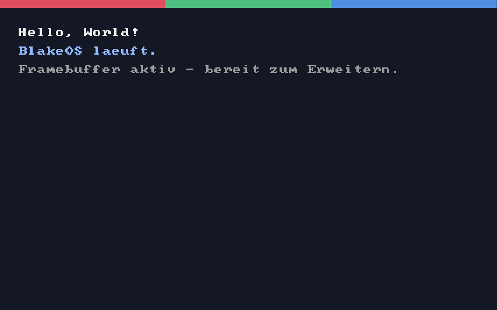

# BlakeOS – ein minimales Hobby-Betriebssystem

Bootet über den **Limine**-Bootloader (BIOS + UEFI), bekommt einen linearen
Grafik-Framebuffer und rendert Text mit einer Bitmap-Schrift. Modular aufgebaut,
damit du Stück für Stück erweitern kannst.



## Aufbau

```
blakeos/
├── Makefile            # baut Kernel + bootfähiges ISO, startet QEMU
├── linker.ld           # platziert den Kernel im higher half (0xffffffff80000000)
├── limine.conf         # Boot-Menü-Konfiguration
├── include/
│   ├── limine.h        # Limine-Boot-Protokoll (vom Bootloader)
│   └── font8x8_basic.h # gemeinfreie 8x8-Bitmap-Schrift
└── src/
    ├── kernel.c        # Einstiegspunkt: Anfragen an Limine, alles verdrahten
    ├── framebuffer.c/.h# rohe Pixel: Punkte, Rechtecke, Bildschirm löschen
    ├── font.c/.h       # liefert Glyph-Bitmaps für ein Zeichen
    └── console.c/.h    # Textausgabe: Cursor, Zeilenumbruch, Skalierung, Farben
```

Die Module sind sauber getrennt:
**framebuffer** kennt nur Pixel, **font** nur Glyphen, **console** kombiniert
beide zu Text, und **kernel** verbindet alles mit dem Bootloader. Neue Module
(Tastatur, Speicherverwaltung, Interrupts ...) hängst du genauso an.

## Voraussetzungen

- `clang` und `ld.lld` (LLVM ist von Haus aus ein Cross-Compiler – keine
  eigene GCC-Toolchain nötig)
- `xorriso` zum Bauen des ISO-Images
- `qemu-system-x86_64` zum Testen
- der **Limine**-Bootloader (siehe unten)

Auf Debian/Ubuntu:
```
sudo apt install clang lld xorriso qemu-system-x86
```

## Limine besorgen

```
git clone https://github.com/limine-bootloader/limine.git \
    --branch=v8.x-binary --depth=1
make -C limine        # baut das kleine 'limine'-Host-Tool
```

Lege den `limine`-Ordner neben `blakeos/` ab (Standard), oder gib den Pfad beim
Bauen an: `make LIMINE_DIR=/pfad/zu/limine`.

## Bauen und starten

```
make            # kompiliert den Kernel und erzeugt blakeos.iso
make run        # startet das ISO in QEMU (BIOS-Modus)
```

Für den UEFI-Modus brauchst du OVMF-Firmware (`sudo apt install ovmf`):
```
make run-uefi
```

## Wie es funktioniert (Kurzfassung)

1. Der Kernel legt im Abschnitt `.limine_requests` Strukturen ab, die Limine vor
   dem Start liest – darunter die Bitte um einen Framebuffer.
2. Limine richtet den 64-Bit-Long-Mode samt Paging ein und springt nach `kmain`.
3. `kmain` holt die Framebuffer-Adresse, Breite, Höhe und `pitch` aus der Antwort.
4. Wir schreiben 32-Bit-Pixel direkt in den Speicher – das ist die ganze „Grafik".
5. Die Konsole zeichnet pro Zeichen ein 8x8-Glyph, skaliert auf 24x24 Pixel.

## Nächste sinnvolle Schritte

- **Serielle Ausgabe** (COM1) zum Debuggen – einfacher als Framebuffer-Text.
- **GDT** neu setzen (eigene Segmentdeskriptoren).
- **IDT + Interrupts**, dann den **PS/2-Tastaturtreiber** anbinden.
- **Physische Speicherverwaltung** (Limine liefert eine Memory-Map mit).
- Danach: Heap (`kmalloc`), Multitasking, Dateisystem ...

Das OSDev-Wiki (https://wiki.osdev.org) und die Limine-Beispiele
(https://github.com/limine-bootloader/limine-c-template) sind die besten
Begleiter für jeden dieser Schritte.
